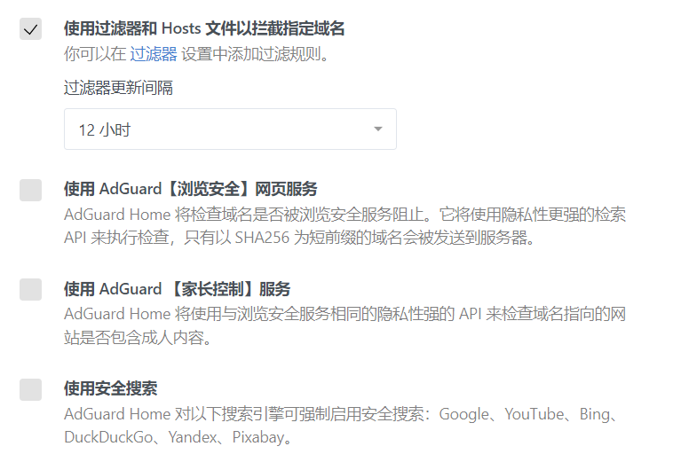

# ADGuardHome食用指北

本页属性及简介：

本页最后更新时间：2022年8月18日

简介：ADGuardHome食用指北

## 在OpenWrt中使用

### 程序配置

#### 设置->常规设置



#### 设置->DNS设置

上游填写如下：

```text
https://dns.alidns.com/dns-query
https://doh.pub/dns-query
https://doh.opendns.com/dns-query
https://dns.google/dns-query
https://cloudflare-dns.com/dns-query
```

选择并行请求

Bootstrap DNS 服务器：

```text
1.1.1.1:53
114.114.114.114:53
8.8.8.8:53
208.67.220.220:53
9.9.9.10
149.112.112.10
```

过滤器->DNS拦截列表：

AdRules AdGuard Filter List 合并的AdGuard列表

<https://raw.githubusercontent.com/Cats-Team/AdRules/main/adguard.txt>

AdRules AdBlock List 通用规则

<https://raw.githubusercontent.com/Cats-Team/AdRules/main/adblock.txt>

过滤器->DNS运行列表：

AdRules Allowlist 允许名单

<https://raw.githubusercontent.com/Cats-Team/AdRules/main/allow.txt>
