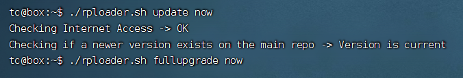
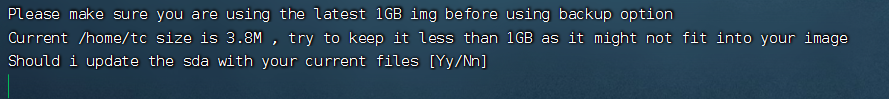

# DSM7.01编译记录(Tinycore-RedPill)

本页属性及简介：

本页最后更新时间：2022年8月16日

简介：将 pocopico/tinycore-redpill 项目换源至 Gitee 以实现免魔法编译群晖并为此写的教程

## 使用的项目

原项目: [pocopico/tinycore-redpill](https://github.com/pocopico/tinycore-redpill)

换源后项目：[kimikkorow/tinycore-redpill](https://gitee.com/kimikkorow/tinycore-redpill)

### 基本流程

1. 下载仓库中的镜像（tinycore-redpill.v0.9.0.2.img.gz），解压并用 [Rufus](https://rufus.ie/zh/) 写入U盘。在写入期间会格式化U盘，请自行备份原有数据。

2. 设置u盘启动，进系统后打开终端输入 ```ifconfig``` 回车查看局域网 IP 地址并记录

3. 换个电脑使用 [FinalShell](https://www.hostbuf.com/) 进行 ssh 连接设备

    - IP为第 2 步获取到的IP
    - ssh用户名：tc
    - 密码：P@ssw0rd

4. 运行以下命令替换原有的rploader.sh文件

    ```bash
    sudo curl -k https://gitee.com/kimikkorow/tinycore-redpill/raw/develop/rploader.sh -O
    ```

5. 运行以下命令以禁止 git 验证 ssl（防止时间错误导致无法正常 clone 仓库）

    ```bash
    git config --global http.sslVerify false
    ```

6. 更新资源，从Gitee仓库获取所需文件并替换旧的文件

```bash
./rploader.sh update now
./rploader.sh fullupgrade now
```

> PS：
>
> 完成以上步骤后，即可开始编译镜像
>
> 记得把需要用到的设备全部接上，PVE环境需要直通设备
>
> PAT文件用官网下载的不带updatexxxx尾标的版本/保证编译的版本和下载的PAT版本一致
>
> 安装的时候断网/限速（拔掉WAN口网线/断掉广域网）
>
> 所有命令请自行注意格式完整规范
>
> 如果理解以上内容可以跳过，以下内容为详细教程！

### 参考教程

#### 更新资源

```./rploader.sh update now```



```./rploader.sh fullupgrade now```



这里输入Y回车

#### 自动修改配置文件

##### 生成SN

```./rploader.sh serialgen DS3615xs```
后面询问是否写入配置文件的都可以输入Y然后回车

##### U盘引导需要额外设置PID、VID

```./rploader.sh identifyusb now```

##### 生成引导磁盘参数

```./rploader.sh satamap now```

如果自己知道 SN、MAC、PID、VID、SATAMAP 等参数可以直接这步，手动修改配置文件或者后期修改镜像内grub文件

#### 正式开始编译

```./rploader.sh build bromolow-7.0.1-42218```

完成编译后，在redpill-load目录里找到loader.img文件，备份好loader.img文件后重启即可自动进入群晖引导

编译命令的格式：

```bash
./rploader.sh build 机型代号-DSM版本号
```

以下为机型代号：

> DS918+      apollolake
>
> DS3615xs    bromolow
>
> DS3617xs    broadwell
>
> DS3622xs    broadwellnk
>
> DS1621        v1000
>
> DVA3221     denverton
>
> DS920         geminilake

完整示范：

```text
【DS918+】
./rploader.sh update now

./rploader.sh fullupgrade now

./rploader.sh clean now

./rploader.sh serialgen DS918+

./rploader.sh identifyusb now

./rploader.sh satamap now

./rploader.sh build apollolake-7.0.1-42218

【DS3615xs】
./rploader.sh update now

./rploader.sh fullupgrade now

./rploader.sh clean now

./rploader.sh serialgen DS3615xs

./rploader.sh identifyusb now

./rploader.sh satamap now

./rploader.sh build bromolow-7.0.1-42218


【DS3617xs】
./rploader.sh update now

./rploader.sh fullupgrade now

./rploader.sh clean now

./rploader.sh serialgen DS3617xs

./rploader.sh identifyusb now

./rploader.sh satamap now

./rploader.sh build broadwell-7.0.1-42218
```

个人不推荐使用7.1，7.1的解码验证比较复杂，且因为分区的改变导致无法降级，自行判断需求决定是否升级，在7.0.1安心养老也是不错的选择。

最后白裙那种东西最后也还是会有的，对吧？

## PS:引用仓库版权归原作者所有，本人只做了换源处理，对于任何操作导致数据丢失等任何问题，没有人为此负责
