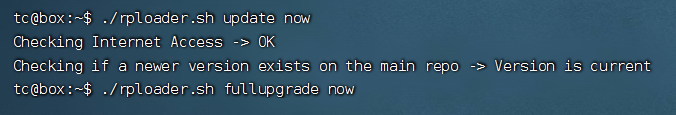
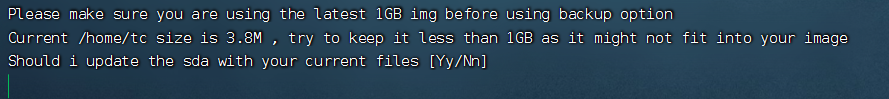

使用的项目：[pocopico/tinycore-redpill](https://github.com/pocopico/tinycore-redpill)

换源后项目：[kimikkorow/tinycore-redpill](https://gitee.com/kimikkorow/tinycore-redpill)

#### 基本流程：

1. 下载镜像，用[Rufus](https://rufus.ie/zh/)写入U盘。在写入期间会格式化U盘，请自行备份原有数据。

2. 设置u盘启动，进系统后打开终端输入```ifconfig```回车查看IP地址并记录

3. 换个电脑使用[FinalShell](https://www.hostbuf.com/)进行ssh连接
> IP为上一步获取到的IP
> ssh用户名：tc
> 密码：P@ssw0rd
4. 双击rploader.sh文件打开，使用[换源后仓库](https://gitee.com/kimikkorow/tinycore-redpill)的rploader.sh文件内容覆盖掉原有内容

5. 运行命令以禁止git验证ssl（防止时间错误导致无法正常使用）
```git config --global http.sslVerify false```
> curl在换源后仓库的rploader.sh文件中已经禁止ssl验证，可以跳过
##### PS：记得把需要用到的设备全部接上，虚拟机需要直通

#### 更新资源：
```./rploader.sh update now```


```./rploader.sh fullupgrade now```

这里输入Y回车

#### 生成SN：
```./rploader.sh serialgen DS3615xs```
后面询问是否写入配置文件的都可以输入Y然后回车

#### U盘引导需要额外设置PID、VID：
```./rploader.sh identifyusb now```

#### 生成引导磁盘参数：
```./rploader.sh satamap now```

#### 正式开始编译：
```./rploader.sh build bromolow-7.0.1-42218```
PS：
- 如果自己知道SN、MAC、PID、VID、SATAMAP等可以直接这步，然后修改镜像
- 没有异常的话，会在redpill-load目录里找到loader.img文件，备份好loader.img文件后重启即可自动进入群晖引导
- 以下为机型代号以及示范：

> DS918+      apollolake
> DS3615xs    bromolow
> DS3617xs    broadwell
> DS3622xs    broadwellnk
> DS1621        v1000
> DVA3221     denverton
> DS920         geminilake

```
【DS918+】
./rploader.sh update now

./rploader.sh fullupgrade now

./rploader.sh serialgen DS918+

./rploader.sh identifyusb now

./rploader.sh satamap now

./rploader.sh build apollolake-7.0.1-42218

./rploader.sh clean now

./rploader.sh build apollolake-7.1.0-42661

【DS3615xs】
./rploader.sh update now

./rploader.sh fullupgrade now

./rploader.sh serialgen DS3615xs

./rploader.sh identifyusb now

./rploader.sh satamap now

./rploader.sh build bromolow-7.0.1-42218

./rploader.sh clean now

./rploader.sh build bromolow-7.1.0-42661 

【DS3617xs】
./rploader.sh update now

./rploader.sh fullupgrade now

./rploader.sh serialgen DS3617xs

./rploader.sh identifyusb now

./rploader.sh satamap now

./rploader.sh build broadwell-7.0.1-42218

./rploader.sh clean now

./rploader.sh build broadwell-7.1.0-42661
```

个人不推荐使用7.1，7.1的解码验证比较复杂，且因为分区的改变导致无法降级，自行判断需求决定是否升级，在7.0.1安心养老也是不错的选择。

最后白裙那种东西最后也还是会有的，对吧？

### PS:引用仓库版权归原作者所有，本人只做了换源处理，对于任何操作导致数据丢失等任何问题，没有人为此负责！