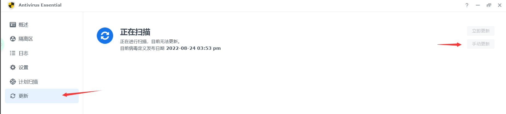

# DSM安全加固

## 更新病毒定义库

在线更新可能会出现莫名其妙的问题，此处只给出官方提供的手动更新方法

- 使用计算机上的网页浏览器下载以下 3 个定义文件：

<https://database.clamav.net/daily.cvd>

<https://database.clamav.net/main.cvd>

<https://database.clamav.net/bytecode.cvd>

选择手动更新后，按提示上传三个定义文件即可，套件会自动更新定义库

在计划扫描中可以设置自动扫描任务
