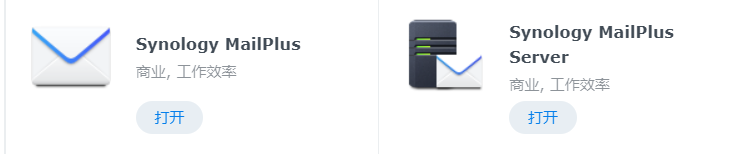
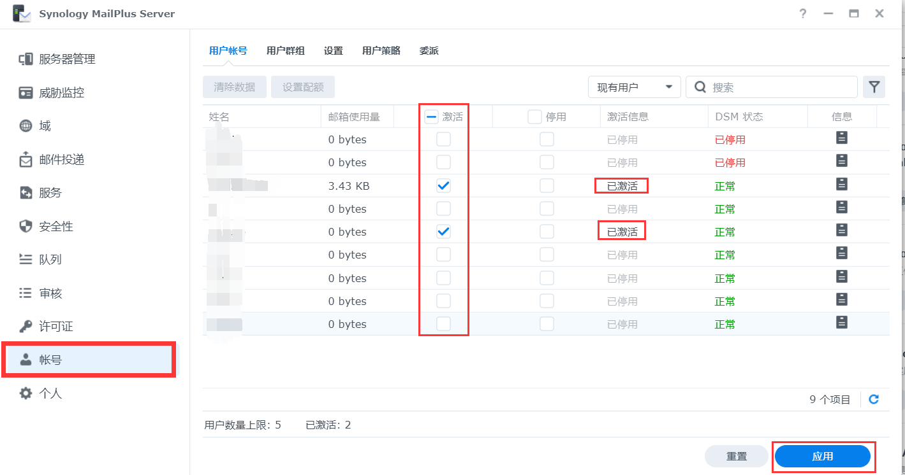
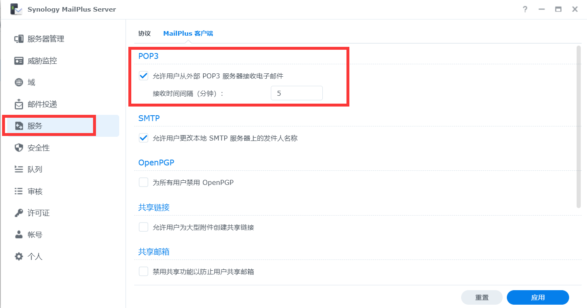

# DSM邮件管理

在套件中心安装以下套件

为用户添加授权

开启POP3服务

完成以上设置后，在 Synology MailPlus 中配置POP3和SMTP服务即可接收邮件

## 各种邮箱设置参考

|邮箱|POP3服务器（995）|SMTP服务器（465或587）|IMAP(993)|账号|密码|
|:---:|:---:|:---:|:---:|:---:|:---:|
|<https://mail.qq.com>|pop.qq.com|smtp.qq.com|imap.qq.com|xxxx@qq.com|授权码(设置->账号->POP3...)|
|<https://mail.163.com>|pop.163.com|smtp.163.com|imap.163.com|xxxx@163.com|授权码(设置->POP3...)|
