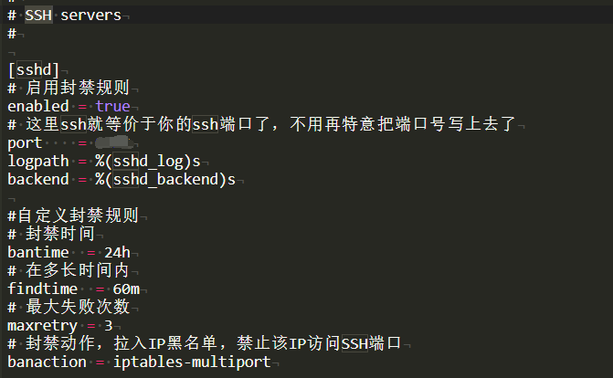

# Linux 安全加固

本页最后更新时间：2022年8月23日

## 参考教程

[利用Fail2Ban保护你的服务器(Fail2Ban使用教程)](https://www.hash070.top/archives/fail2ban.html)

### 安装 Fail2Ban

CentOS

```bash
sudo yum install fail2ban
```

Debian&Ubuntu

```bash
sudo apt install fail2ban
```

### 调整 Fail2Ban 配置文件

```bash
nano /etc/fail2ban/jail.conf
```

在配置文件的“[DEFAULT]”区，你可以在此定义所有受监控的服务的默认参数，另外在特定服务的配置部分，你可以为每个服务（例如SSH，Apache等）设置特定的配置来覆盖默认的参数配置。

这三个是比较重要配置项，默认值如下

```text
# 封禁时间
bantime  = 10m
# 在多长时间内
findtime  = 10m
# 最大失败次数
maxretry = 5
```

它的意思是：在10分钟内，如果失败超过5次，那么就将这个IP丢到小黑屋里10分钟。

### 配置SSH登录保护

在配置区块中找到SSH servers字样的配置片段，然后默认配置就如下图所示，可以看到这个已经是配置好了，我们只需要在前面加一个 enabled = true 标记这个配置片段已经启用就行了。



```text
[sshd]
# 启用封禁规则
enabled = true
# 这里ssh就等价于你的ssh端口了，不用再特意把端口号写上去了
port    = ssh
logpath = %(sshd_log)s
backend = %(sshd_backend)s

#自定义封禁规则
# 封禁时间
bantime  = 24h
# 在多长时间内
findtime  = 1m
# 最大失败次数
maxretry = 3
# 封禁动作，拉入IP黑名单，禁止该IP访问SSH端口
banaction = iptables-multiport
```

按需求修改代码并使用以下代码重启服务

```bash
sudo systemctl enable fail2ban
sudo systemctl start fail2ban
sudo systemctl status fail2ban
```
