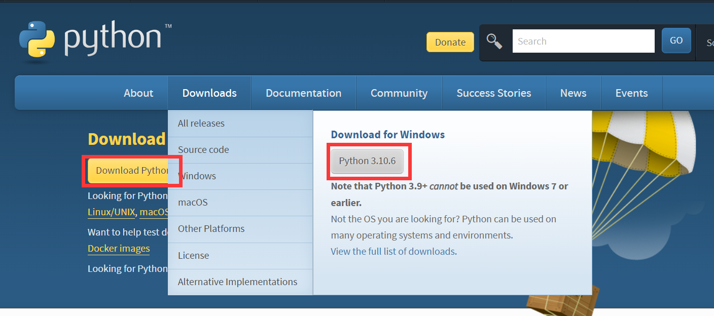
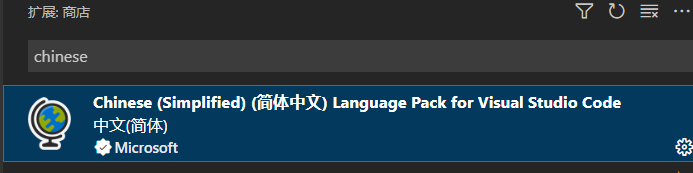
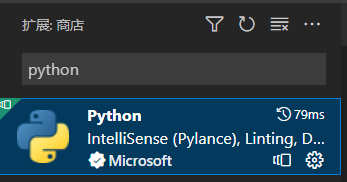

# vscode配置开发环境

基本流程

- 安装相应环境

- 配置环境变量

- 安装[VScode](https://code.visualstudio.com/Download)

- 安装相应插件

- 在项目目录生成launch.json

## python

1、前往[python官网](https://www.python.org/downloads/)下载所需架构的安装包

双击exe安装包，在窗口底部可以看见添加环境变量的选项，勾选后即可自动添加到系统环境变量

2、安装并运行VScode，在左侧拓展处搜索chinese安装中文插件

安装好插件后重启VScode

3、新建一个文件夹并添加 py文件

使用vscode打开此文件夹，在左侧找到运行和调试，点击创建 launch.json文件 选择正确的类型即可

4、ctrl+F5即可运行 py文件，或者单击顶部右侧播放键

## java

1、下载并安装[openjdk](https://developers.redhat.com/products/openjdk/download)

2、安装插件
