# 尚硅谷Git入门到精通全套教程(涵盖GitHubGitee码云GitLab)笔记

本页最后更新时间：2022年8月23日

## Git 概述

Git 是一个免费的、开源的分布式版本控制系统，可以快速高效地处理从小型到大型的各种
项目。

Git 易于学习，占地面积小，性能极快。 它具有廉价的本地库，方便的暂存区域和多个工作
流分支等特性。其性能优于 Subversion、CVS、Perforce 和 ClearCase 等版本控制工具。

### 何为版本控制

版本控制是一种记录文件内容变化，以便将来查阅特定版本修订情况的系统。
版本控制其实最重要的是可以记录文件修改历史记录，从而让用户能够查看历史版本，
方便版本切换。

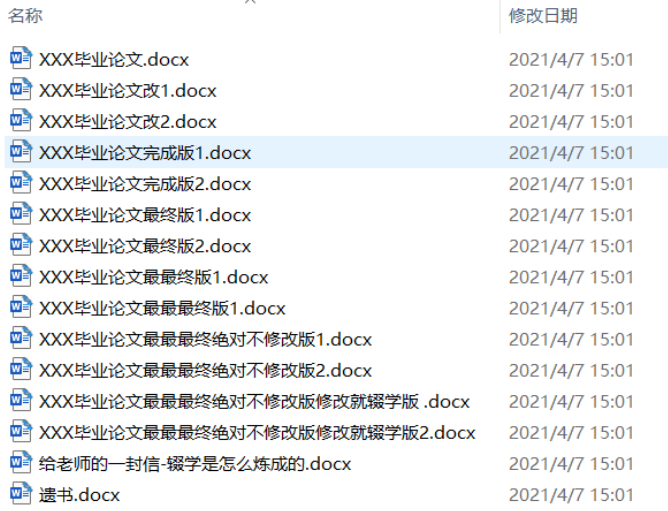

### 为什么需要版本控制

个人开发过渡到团队协作。

## 安装 Git

[Git](https://git-scm.com/downloads)

[GitHub Desktop](https://desktop.github.com/)

确认 Git 正确安装

```bash
git -v

或者

git --version
```


## Git 常用命令

|命令名称|作用|
|:---|:---|
|***git config --global user.name*** |用户名 设置用户签名|
|***git config --global user.email*** |邮箱 设置用户签名|
|git init |初始化本地库|
|git status |查看本地库状态|
|git add 文件名 |添加到暂存区|
|git commit -m "日志信息" 文件名 |提交到本地库|
|git reflog |查看历史记录|
|git reset --hard 版本号 |版本穿梭|

> git config --global xxx 只需要设置一次

### 设置全局签名(提交代码用)

```bash
cat ~/.gitconfig
```

> ~ 表示用户文件夹

### 创建项目

创建文件夹

```bash
mkdir ./git_test
```

进入目录

```bash
cd ./git_test
```

初始化仓库

```bash
git init
```

检查是否生成 .git 文件夹

```bash
ls -a
```

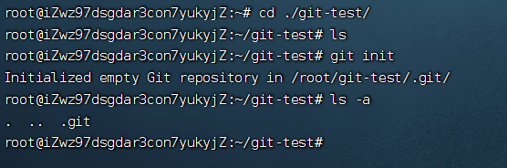

查看本地库状态

```bash
git status
```

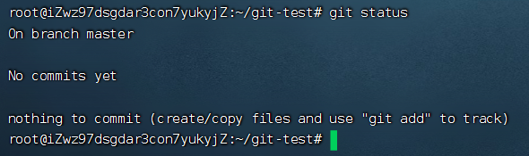

此时没有任何提交，且目前所在的分支为 master

新增文件并且写入内容

```bash
nano hello.text
```

我写入的内容

```text
hello 
hello
hello
hello
```

ctrl+x保存

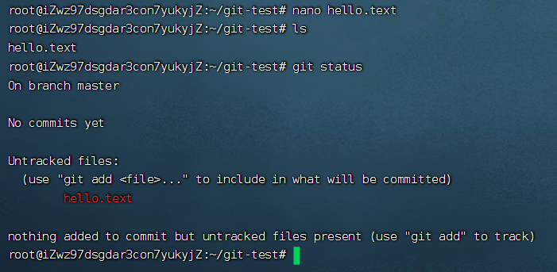

再次查看状态口可以发现新增的文件(红色)

添加到暂存区

```bash
git add hello.text
```

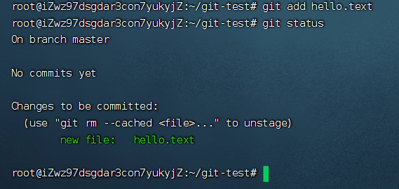

此时状态（检测到暂存区有新文件）

提交到本地库

```bash
git commit -m "first commit" hello.text
```

如果再次之前没有设置，则会报错

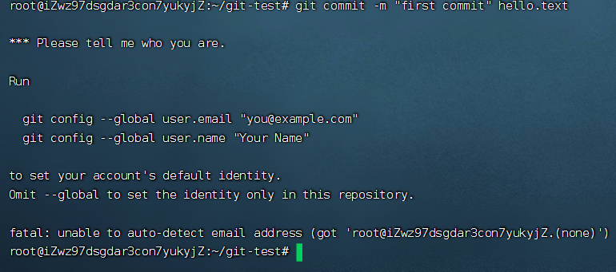

根据提示设置全局签名后，再次运行即可正常提交

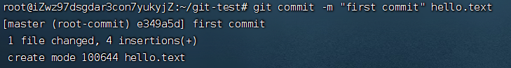

此时已经完成了第一次提交，再次修改文件后，继续循环 git add 文件名 -> git commit "提交信息" 文件名 即可完成第二次提交

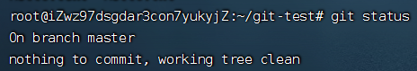

第二次提交完成后，可以看到状态又恢复到了最初的状态

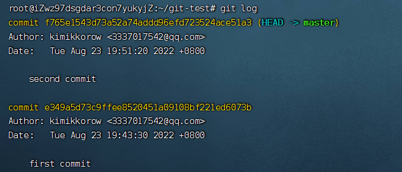

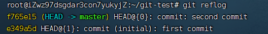

对比可知

git log        显示详细历史提交信息 并标记出当前文件所在版本及分支（完整的hash值、提交人、时间）

git reflog    显示历史提交信息 并标记出当前文件所在版本及分支

### 切换版本

git reset --hard 版本号

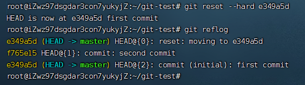

此时可以发现，master分支版本号已经指向了第一次的版本号

## 分支操作
